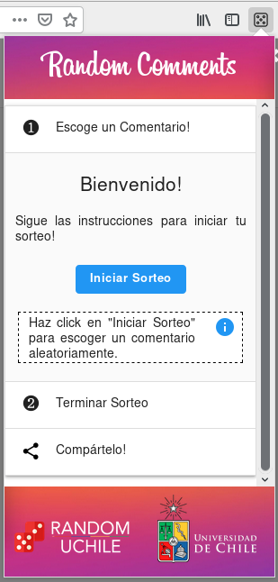
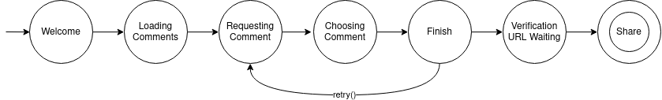
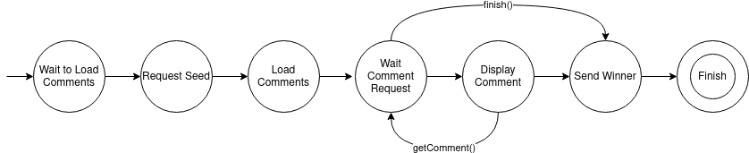
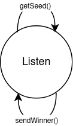

# Random Comments

Esta extensión se divide en tres scripts, el primero es para el popup que aparece cuando el usuario comienza a 
interactuar con la misma, el segundo es aquel que trabaja sobre la página del sorteo (content script) y el tercero
(background script) que fue agregado casi al final de la etapa de desarrollo siendo el encargado de hacer todo tipo de 
request que requiera Cross-Origin Resource Sharing (CORS).

## Popup

Un popup, más que un script es toda una interfaz por sí misma y por ende contiene su propio Javascript, HTML y CSS. Es 
compatible tanto con Firefox como con Chrome (ver referencias al final). 

En esta extensión en específico el popup trabaja como una máquina de estados, donde cada estado representa una etapa del
sorteo. Notar que por defecto un popup no tiene memoria de su estado, es decir, sus scripts son ejecutados desde cero
cada vez que vuelve a abrir, es por ello que se decidió guardar el estado del sorteo en el script que trabaja sobre la 
página del sorteo, el que es solicitado cada vez que se abre la extensión. A continuación se muestra un diagrama de los
estados del popup:

Si deseas saber qué hace específicamente cada estado, visita el siguiente [link](../popup/js/interface.js).

Aquí podrás encontrar más información acerca popups para [Firefox](https://developer.mozilla.org/en-US/docs/Mozilla/Add-ons/WebExtensions/user_interface/Popups) y navegadores basados en [Chromium](https://developer.chrome.com/extensions/user_interface#popup).

## Content Scripts

Es un script de la extensión que corre directamente sobre el sitio del sorteo (es inyectado), y por ende permite hacer
modificaciones sobre la misma página. En esta extensión se utiliza principalmente para guardar el estado del sorteo, de
esta manera si el usuario cambia de URL se pierde el estado del sorteo en el que se estaba. Esto es utilizado por el
popup mencionado más arriba. Tambien permite interactuar con el usuario modificando la misma página del sorteo 
(agregando un modal al inicio y al final o resaltando las personas elegidas en el sorteo por ejemplo).  

Es importante mencionar que este script también funciona como una máquina de estados, la que puede ser apreciada en la 
siguiente imagen:

## Background Script

Debido a que desde su versión 73, Chrome acotó los [permisos](https://www.chromium.org/Home/chromium-security/extension-content-script-fetches) de los Content Scripts, se debió agregar un background
script a la extensión para poder realizar Cross-Origin HTTP requests ya que para poder utilizar la API de Random UChile
se requiere hacer una consulta GET a un origen distinto al de la extensión misma, lo mismo con la generación de la 
página de verificación (pero con POST).

Este script es símplemente un listener que espera a que los otros scripts le pidan realizar estas consultas (esto a 
través de la WebExtensions API). Debido a que en Chrome, este script no puede correr persistentemente en background (por 
motivos de seguridad explicados aquí), este se ejecuta solo cuando el usuario interactúa con el popup.

    

Si te interesa crear una aplicación que usa la API de Random UChile en la que tus usuarios puedan utilizar aleatoriedad
verificable, por favor visita el siguiente link. 

