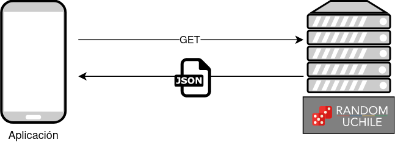
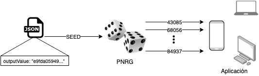
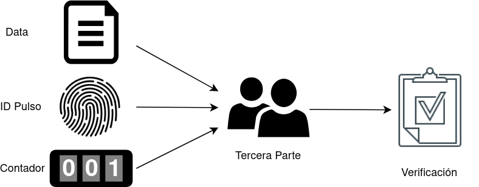
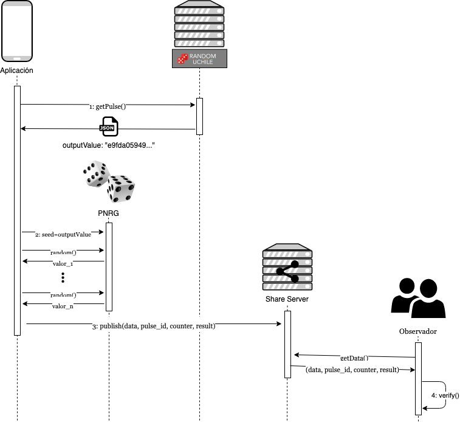

# Randomness Beacon API - Random UChile

Este documento es una guía sobre cómo utilizar la [API del Faro de Aleatoriedad (*Randomness Beacon*)](https://random.uchile.cl/development) de [Random UChile](https://random.uchile.cl) para crear una aplicación que utilice 
la aleatoriedad generada por el Faro de Random UChile y que cualquier persona pueda verificar, a posteriori, la validez del proceso.

## 1. Llamado a la API

En cada uno de los *endpoints* de la API, se responde con un **pulso aleatorio**, el cual es una respuesta en formato JSON que contiene, entre otros valores, el valor aleatorio (string que representa un valor de 512 bits, en hexadecimal) generado en dicho minuto. Dicho valor se accede en el campo `pulse.outputValue`. 

<p align="center">
    
</p>

### Ejemplo: API

#### 1.1 Javascript
```javascript
function handleJSON(err, data) {
    // do something with the JSON
}

// Get last pulse generated
const beaconURL = "https://beacon.clcert.cl/beacon/2.0/pulse/last";
let xhr = new XMLHttpRequest();
xhr.open("GET", beaconURL, true);
xhr.onload = function () {
   if (xhr.status === 200) {
       const beaconPulse = JSON.parse(xhr.response).pulse;
       handleJSON(null, beaconPulse);
   } else {
       handleJSON(xhr.status, null);
   }
};
xhr.send();
```

#### 1.2 Python
```python
import requests

def handle_json(data):
    # do something with the JSON

# Get last pulse generated
beacon_url = "https://beacon.clcert.cl/beacon/2.0/pulse/last"
content = requests.get(beacon_url)
pulse = content.json()["pulse"]
handle_json(pulse)
```

## 2. Uso del valor aleatorio

Una vez obtenido dicho valor aleatorio (`outputValue`), este puede ser utilizado como semilla para un generador pseudo aleatorio (PRNG por sus siglas en inglés), que sirve para obtener flujo de números aleatorios, los cuales pueden ser utilizados de la manera que la aplicación a desarrollar necesite. Algunos ejemplos de usos más comunes son: selección al azar de un número entero en un rango específico, escoger uno (o varios) elemento(s) al azar de un conjunto, revolver (cambiar el orden) de los elementos de un conjunto, etc.

<p align="center">
    
</p>

### Ejemplo: Valor aleatorio (`outputValue`) en PRNG

##### 2.1 Javascript
```javascript
// Pendiente
```

##### 2.2 Python
```python
import random

def handle_json(data):
    beacon_seed = data["outputValue"]  # Get outputValue from pulse
    random.seed(beacon_seed)  # Seed the default PRNG
    return random.randint(0, 10)  # Get a random integer in a range
```

## 3. Datos para verificación del proceso aleatorio

Una vez que se ha finalizado el aleatorio, puede ser de interés para alguna persona verificar que dicho proceso aleatorio fue legítimo (es decir, que el resultado fue realmente al azar y no fue escogido "a dedo"). Esta verificación es la principal razón para el uso de los valores generados por el Faro de Aleatoriedad. Para poder proveer un servicio aleatorio que sea verificable se sugiere seguir las siguientes directrices:

1. Guardar el estado inicial (*input*) sobre el cual se ejecutará la función aleatoria, por ejemplo, el conjunto de todos los elementos posibles (preservando el orden).

2. Guardar el pulso cuyo valor aleatorio será utilizado como semilla del PRNG.

3. Por cada llamada que se realice al PRNG, se aumenta un contador que se inicializa en cero al establecer la semilla.

4. Al momento de publicar el resultado final, publicar además el (1) estado inicial, (2) el pulso alearorio, y (3) el valor del contador de llamados.

Con toda la información publicada en el punto 4, cualquier persona puede verificar que el proceso fue llevado a cabo correctamente.

<p align="center">
    
</p>

<!-- TODO: Agregar código ejemplo --> 

## 4. Verificación por un observador externo 

Una parte fundamental del proceso es poder brindar un servicio de verificación para cualquier observador externo de que el proceso aleatorio fue llevado a cabo correctamente. Para ello se deben cumplir los siguientes requisitos:

1. Algoritmo público: el proceso aleatorio en cuestión debe ser público, y lo único que hace impredecible su resultado es la semilla a utilizar en el PRNG.

2. Publicación de los datos: todos los datos generados siguiendo los pasos descritos en la sección anterior deben ser públicos y de libre acceso por parte de cualquier persona que quiera verificar el proceso.

3. Código fuente de *script* de verificación: para asegurar la mayor transparencia posible, se debe publicar el código fuente que verifique el proceso. Este *script* debe replicar el algoritmo del procesos aleatorio, utilizando los datos publicados en el punto 2. 

4. [Opcional] Servicio de verificación: además del código fuente, es deseable que la organización (o persona) que esté a cargo del proceso aleatorio brinde un servicio de verificación, montado en servidores propios, que tenga la posibilidad de aceptar los datos publicados y recrear el sorteo, permitiendo a las personas verificar que el resultado final es correcto y, fundamentalmente, aleatorio.

## Resumen General

Los pasos anteriormente descritos se pueden resumir en el siguiente diagrama:

<p align="center">
    
</p>
